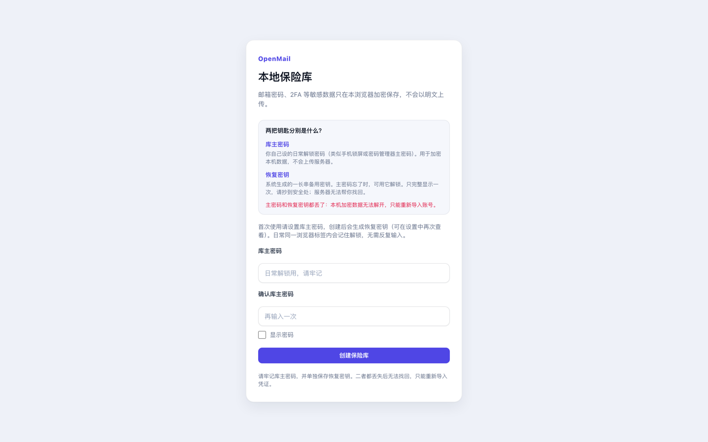
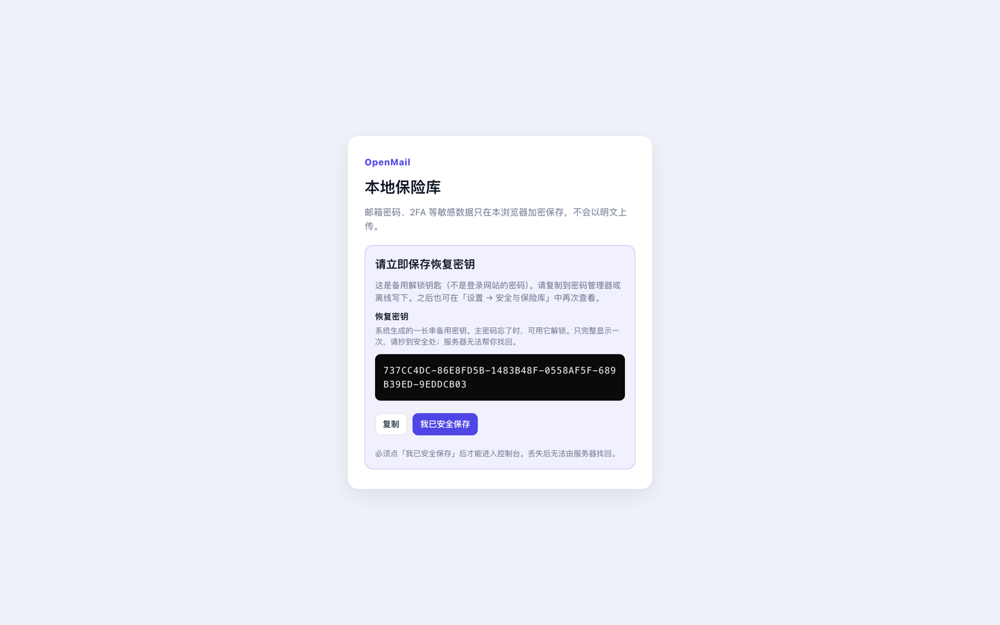
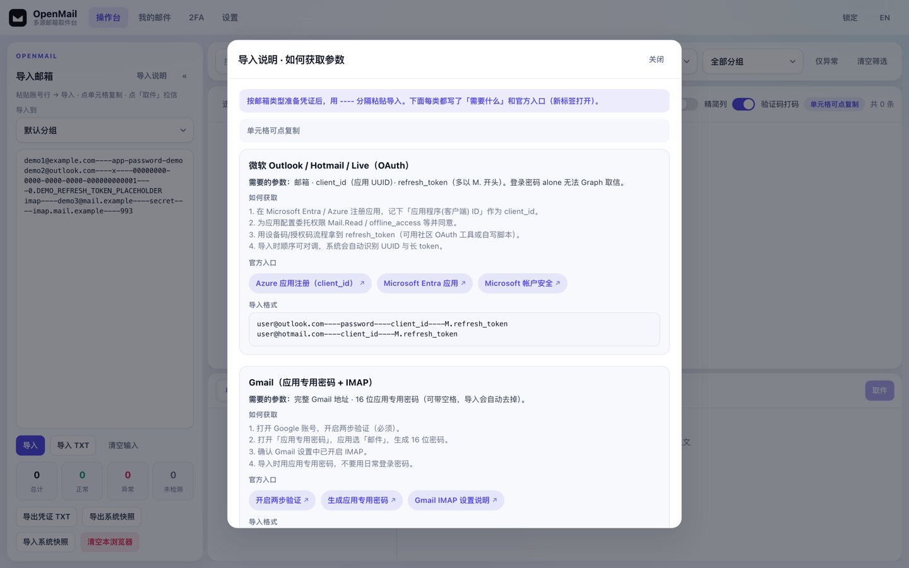
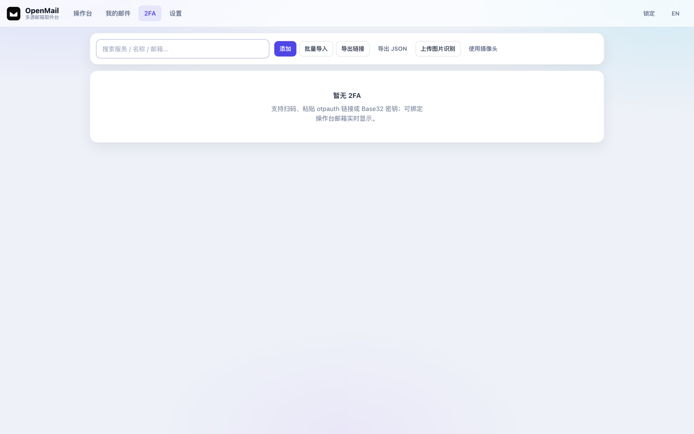
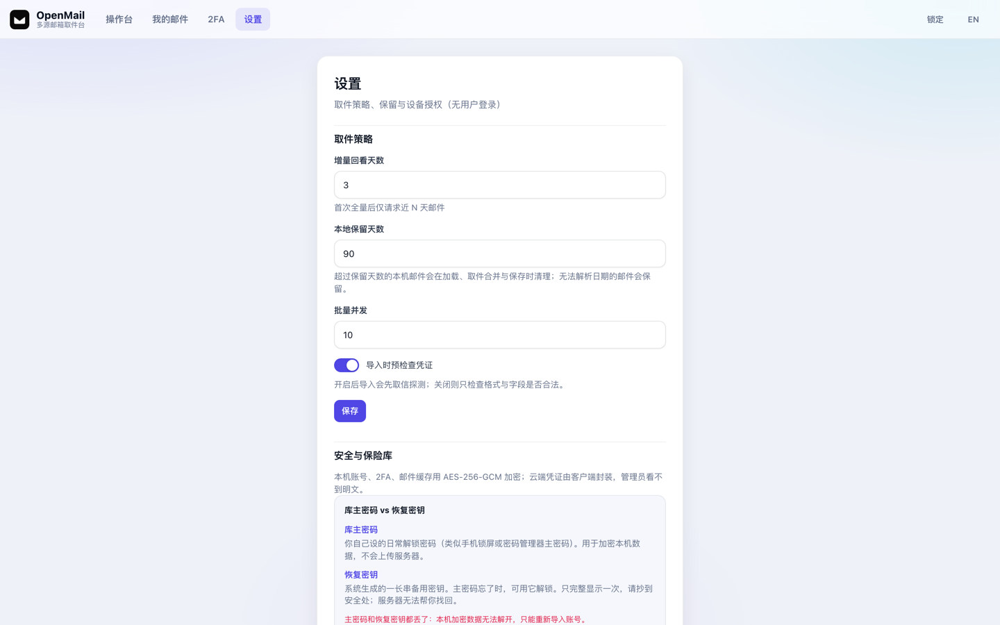
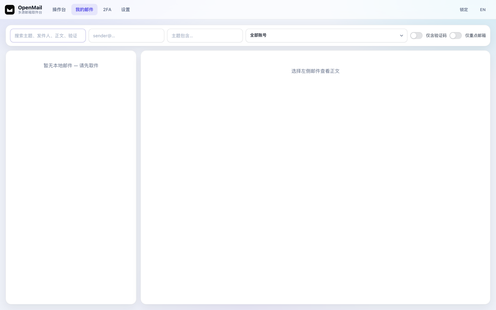

<div align="center">


# OpenMail

**Local-first multi-source mailbox console**

[](https://github.com/IanShaw027/openmail/actions/workflows/ci.yml)
[](LICENSE)
[](https://hub.docker.com/r/ianshaw027/openmail)
[](https://hub.docker.com/r/ianshaw027/openmail)
[](backend/pyproject.toml)
[](frontend/package.json)
[](https://github.com/IanShaw027/openmail/releases)

English · [中文](README_CN.md)

Import credentials in the browser, proxy fetch/send through a self-hosted FastAPI backend, and keep secrets encrypted with a vault password. Optional cloud rows are **client-sealed** — operators with DB access should not obtain plaintext vault secrets without your vault key.

<br />


### Live demo

**[https://mail.clomio.ai](https://mail.clomio.ai)** — public test instance

> Create your own vault password on first visit. Secrets stay in **your browser**. Do **not** put production-critical mailboxes on a shared demo.

</div>

---

## Screenshots

| Vault setup | Recovery key (save once) |
|:-----------:|:------------------------:|
|  |  |

| Console + import | 2FA manager |
|:----------------:|:-----------:|
|  |  |

| Settings | Local mail cache |
|:--------:|:----------------:|
|  |  |

---

## Table of contents

- [Screenshots](#screenshots)
- [Before you use](#before-you-use)
- [How it works](#how-it-works)
- [Features](#features)
- [Providers](#providers)
- [Quick start (Docker)](#quick-start-docker)
- [First visit](#first-visit)
- [Import formats](#import-formats)
- [Configuration](#configuration)
- [Upgrade](#upgrade)
- [Troubleshooting](#troubleshooting)
- [Development](#development)
- [Release](#release-maintainers)
- [Limitations](#limitations)
- [Security & license](#security)

---

## Before you use

| Rule | Detail |
|------|--------|
| Self-hosted | Not multi-tenant SaaS. You own keys, TLS, backups, compliance. |
| Vault secrets stay in the browser | Password + recovery key never uploaded. Lose both → ciphertext unrecoverable. |
| Server sees credentials briefly | Proxy fetch/send must use Graph / IMAP / SMTP / APIs → secrets live in **process memory** for that request. Deploy only on hosts you trust. |
| Authorized mailboxes only | You are responsible for accounts you import. |

Full policy: [SECURITY.md](SECURITY.md) · legal templates under [docs/legal/](docs/legal/).

---

## How it works

```
┌──────────────────────────┐         HTTPS + vault device HMAC         ┌──────────────────────────┐
│  Browser (Vue 3)         │ ────────────────────────────────────────► │  Server (FastAPI)         │
│  • Vault PBKDF2 + AES-GCM│                                           │  • Device registry        │
│  • Accounts / 2FA / cache│ ◄──────────────────────────────────────── │  • Optional sealed cloud  │
│  • localStorage cipher   │         proxy fetch / send                │  • SSRF checks + DNS pin  │
└──────────────────────────┘                                           └────────────┬─────────────┘
                                                                                    │
                                                              Graph · IMAP/SMTP · mail.com · HttpApi
```

1. You create a **vault password** (and get a **recovery key** once).
2. Accounts live in the browser vault (ciphertext). Optionally sync **sealed** blobs to the server (still not readable without the vault).
3. Fetch/send: browser unlocks → sends credentials for that request with HMAC device identity → server talks upstream → returns mail; secrets not persisted as plaintext.

Stack: **Vue 3 + Vite + Pinia** frontend, **FastAPI + SQLite** backend, single Docker image (SPA served by the API).

---

## Features

- **Multi-provider** mailbox console (see table below)
- **Local vault** with recovery key, session resume (same tab), factory reset
- **Device QR transfer** — PC ↔ phone vault sync (short-lived server ciphertext)
- **2FA manager** — TOTP/HOTP/Steam, QR / paste / bulk URI, brand icons, filter + drag reorder, bind to mailboxes
- **Console** — batch import, brand chips, groups, notes, batch fetch, code extract, send, body expand modal
- **Mail list** — first 20 messages; load more (10 older) / clear & refetch
- **Folders** — inbox / junk / sent (IMAP names include non-ASCII via modified UTF-7)
- **Security** — vault device HMAC, SSRF host policy, HTML sanitize, CSP, client-sealed cloud rows
- **Ops** — optional 10× Cloudflare WARP SOCKS pool for concurrent egress
- **i18n** — Chinese + English UI

### Not in scope

- User registration / multi-tenant admin SaaS  
- Full webmail (composer threads, server search index, etc.)  
- Platform-hosted Microsoft OAuth consent screens for you  

---

## Providers

| Provider | Type | What you need | Fetch | Send |
|----------|------|---------------|-------|------|
| **Microsoft Graph** | `oauth` | email + `client_id` + `refresh_token` | ✅ | ✅ (Graph) |
| **IMAP** | `imap` | email + password/app password + host/port | ✅ | ✅ if SMTP resolved |
| **mail.com cookie** | `cookie` | session cookie material | ✅ | limited / provider rules |
| **HTTP API / CF Worker** | `http_api` | API URL (+ optional secret) | ✅ | depends on worker |

IMAP host defaults exist for common domains (Gmail, Outlook, etc.); you can override host/port in the UI.

---

## Quick start (Docker)

**Image (Docker Hub only):**

```text
ianshaw027/openmail:v0.1.0
ianshaw027/openmail:latest
```

- Architecture: **`linux/amd64`**
- Every git tag `vX.Y.Z` → GitHub Actions rebuilds and pushes Hub tags

### A) Compose from this repo (recommended)

```bash
git clone https://github.com/IanShaw027/openmail.git
cd openmail
cp .env.example .env
./scripts/gen-master-key.sh    # paste into OPENMAIL_MASTER_KEY in .env

docker compose pull
docker compose up -d

# UI + API
open http://127.0.0.1:8000
curl -s http://127.0.0.1:8000/api/health
# {"ok":true,"version":"0.1.0","master_key_configured":true,...}
```

Compose default:

```yaml
image: ${OPENMAIL_IMAGE:-ianshaw027/openmail:v0.1.0}
```

Useful `.env` overrides:

```bash
OPENMAIL_IMAGE=ianshaw027/openmail:latest
OPENMAIL_PORT=8000
OPENMAIL_PULL_POLICY=always
```

Data persists in `./data` (SQLite + device registry). **Back up this directory.**

### B) One container (no clone)

```bash
docker run -d --name openmail -p 8000:8000 \
  -e OPENMAIL_MASTER_KEY="$(openssl rand -base64 32)" \
  -v openmail-data:/data \
  ianshaw027/openmail:v0.1.0
```

### C) Build from source

```bash
docker compose up -d --build
# or: ./scripts/install.sh
```

### WARP egress pool (optional)

Host needs `/dev/net/tun`:

```bash
./scripts/up-with-warp.sh
# starts openmail + 10× warp SOCKS nodes (compose profile)
```

Details: [docs/16-warp-proxy-pool.md](docs/16-warp-proxy-pool.md).

---

## First visit

1. Open the UI → **create vault password** (strong, memorable only to you).  
2. **Copy the recovery key** somewhere offline (shown once; also viewable later while unlocked under Settings).  
3. Import accounts (paste TXT or upload) **or** add one mailbox manually.  
4. Select accounts → **Fetch**. Codes / mail list appear in the console; bodies expand in a modal.  
5. Optional: Settings → license token (if your instance uses `LICENSE_TOKENS` quotas).  

Factory reset (Settings) wipes **this browser’s** vault/storage only — not the server DB volume.

---

## Import formats

One account per line. Fields separated by **`----`** (four hyphens).

| Kind | Line shape | Example |
|------|------------|---------|
| Graph OAuth | `email----password----client_id----refresh_token` | `u@x.com----x----abc----0.AXxxx` |
| IMAP (auto host) | `email----password` | `u@gmail.com----xxxx xxxx xxxx xxxx` |
| IMAP (explicit) | `imap----email----password----host----port` | `imap----u@x.com----pw----imap.x.com----993` |
| HttpApi | `https://worker…` or `email----https://…` or `url----secret` | `https://mail.example.workers.dev` |
| mail.com style | cookie / provider-specific paste accepted by parser | (use UI placeholder hints) |

Also supported: full **system snapshot** JSON export/import from the console (credentials + groups + notes layout).

---

## Configuration

Copy [`.env.example`](.env.example) → `.env`. Most important:

| Variable | Required | Purpose |
|----------|----------|---------|
| `OPENMAIL_MASTER_KEY` | **yes** | 32-byte AES key (base64/hex). Device registry + server wraps. |
| `OPENMAIL_DEVICE_ADMISSION` | no | `first_trust` (default): first device auto-trusted, later need approval; `open`: every register is trusted |
| `OPENMAIL_IMAGE` | no | Compose image override (default `ianshaw027/openmail:v0.1.0`) |
| `OPENMAIL_PORT` | no | Host port (default `8000`) |
| `OPENMAIL_DATABASE_URL` | no | Default SQLite on `/data` |
| `LICENSE_TOKENS` | no | Comma-separated codes that unlock client quotas |
| `PROXY_POOL` | no | SOCKS/HTTP exits (`\|` or newlines) |
| `SYNC_*` | no | Background sync interval / folders |
| `PUBLIC_BASE_URL` | no | Public origin for legacy code-token URLs |
| `CODE_API_MAX_FETCH_PER_HOUR` | no | Public code-API cap per token per hour; `0` = no limit |
| `CODE_API_MAX_REFRESH_PER_HOUR` | no | Stricter cap for `refresh=1`; `0` = no limit |

Generate master key:

```bash
./scripts/gen-master-key.sh
```

---

## Upgrade

```bash
cd openmail
git pull
# pin version in .env if you want: OPENMAIL_IMAGE=ianshaw027/openmail:v0.2.0
docker compose pull
docker compose up -d
curl -s http://127.0.0.1:8000/api/health
```

Keep `./data` mounted across upgrades. Read [CHANGELOG.md](CHANGELOG.md) for breaking changes.

### Upgrade notes: the app no longer runs as root

Images up to `v0.3.6` ran as root, so an existing `./data` and `openmail.db` are
owned by `root`. Newer images run the app as an unprivileged uid instead. You do
**not** need to change anything: the container starts as root only long enough to
fix ownership of the mounted data directory, then drops privileges. A
bind-mounted `./data` keeps its current owner; only a `root`-owned directory is
reassigned.

Two things to be aware of:

- If you pin `user:` in `docker-compose.yml` (or pass `--user`), the container
  cannot repair ownership and will refuse to start unless that user already owns
  `./data`. The error message names the uid and the `chown` to run.
- `OPENMAIL_UID`/`OPENMAIL_GID` are no longer used. Leaving them in `.env` is
  harmless.

---

## Troubleshooting

| Symptom | What to check |
|---------|----------------|
| `master_key_configured: false` | `OPENMAIL_MASTER_KEY` empty/invalid in `.env`; recreate container after fix |
| `attempt to write a readonly database` / container restart loop | `./data` is not writable by the container. Upgrade to the latest image (it self-heals), or `sudo chown -R 10001:10001 ./data`. Remove any `user:` override that does not own `./data` |
| Image pull fails on Apple Silicon | Image is **amd64-only** today — use a remote amd64 host, or `docker compose up --build` on arm (local build) |
| IMAP SSL / cert errors | Fixed for DNS-pinned IP + SNI in recent builds; pull latest `v0.1.0+` |
| IMAP `ascii codec` on folder names | Non-ASCII mailbox names need modified UTF-7 — use latest image |
| Vault password every refresh | Same-tab session should resume; hard refresh / other browser needs password or recovery key |
| Recovery key never shown | Create flow must stay on gate until key acknowledged; update if on very old build |
| Demo feels “empty” | Each browser has its **own** vault — nothing is shared across visitors |
| 502 behind nginx | Upstream not up / wrong port; check `docker compose ps` and `curl localhost:8000/api/health` |

Smoke script (API only):

```bash
make smoke BASE_URL=http://127.0.0.1:8000
```

---

## Development

```bash
# Backend
cd backend && python3 -m venv .venv && source .venv/bin/activate
pip install -r requirements.txt
export OPENMAIL_MASTER_KEY="$(python -c 'import os,base64; print(base64.b64encode(os.urandom(32)).decode())')"
uvicorn app.main:app --reload --port 8000

# Frontend (proxies /api → :8000)
cd frontend && npm install && npm run dev
```

Tests:

```bash
cd backend && source .venv/bin/activate && export OPENMAIL_MASTER_KEY=... && pytest -q
cd frontend && npm run build
```

Layout:

```
assets/      Brand SVG
backend/     FastAPI + providers + pytest
frontend/    Vue 3 + Vite + Pinia + i18n
docs/        architecture, ops, WARP, legal
scripts/     install, keygen, smoke, release, warp
.github/     CI + release workflows
```

---

## Release (maintainers)

```bash
# clean main → bump VERSION sources → commit → tag → push
make release V=0.2.0
```

On tag `v0.2.0` CI will:

1. Bake version into the image (`/api/health` → `0.2.0`)  
2. Push Docker Hub: `ianshaw027/openmail:v0.2.0`, `:0.2.0`, `:latest`  
3. Publish GitHub Release notes  

Needs secrets: `DOCKERHUB_TOKEN` (+ optional `DOCKERHUB_USERNAME`).

`main` is protected for non-admins (PR + CI). **Repository owner may push `main` directly.**

---

## Limitations

- Published image is **linux/amd64** only (no multi-arch yet).  
- Not a full mail client (no server-side FTS product, no multi-user tenancy).  
- Proxy path is **not** zero-knowledge while a request runs.  
- Microsoft OAuth: you bring your own app registration / refresh tokens.  
- Some providers (cookie / worker) depend on upstream HTML/API stability.  

Roadmap ideas (not promised): arm64 images, richer send UX, more import presets.

---

## Security

Report vulnerabilities **privately** via [GitHub Security Advisories](https://github.com/IanShaw027/openmail/security/advisories/new) — see [SECURITY.md](SECURITY.md). Do not open public issues for exploitable bugs.

## Contributing

[CONTRIBUTING.md](CONTRIBUTING.md) · [CODE_OF_CONDUCT.md](CODE_OF_CONDUCT.md)

## License

[MIT](LICENSE)

## Legal (instance operators)

- Privacy: [zh](docs/legal/privacy.zh.md) · [en](docs/legal/privacy.en.md)  
- Terms: [zh](docs/legal/terms.zh.md) · [en](docs/legal/terms.en.md)  

Operators are responsible for their deployment, keys, and compliance.

---

## Extra docs (optional depth)

| Doc | Topic |
|-----|--------|
| [docs/architecture.md](docs/architecture.md) | Module boundaries, API surface |
| [docs/14-ops-and-smoke.md](docs/14-ops-and-smoke.md) | Ops checklist |
| [docs/16-warp-proxy-pool.md](docs/16-warp-proxy-pool.md) | WARP profile |
| [docs/17-release.md](docs/17-release.md) | Release internals |
| [CHANGELOG.md](CHANGELOG.md) | Version history |

Brand files: [`assets/logo-icon.svg`](assets/logo-icon.svg) · [`logo.svg`](assets/logo.svg) · [`logo-dark.svg`](assets/logo-dark.svg) · [`social-banner.svg`](assets/social-banner.svg)
