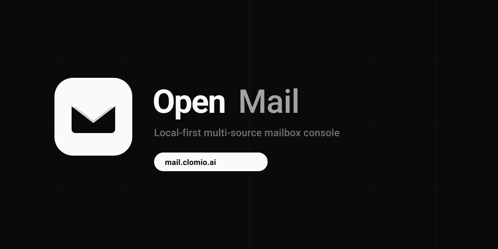

<div align="center">


# OpenMail

**本地优先 · 多源邮箱控制台**

[](https://github.com/IanShaw027/openmail/actions/workflows/ci.yml)
[](LICENSE)
[](https://hub.docker.com/r/ianshaw027/openmail)
[](https://hub.docker.com/r/ianshaw027/openmail)
[](https://github.com/IanShaw027/openmail/releases)

[English](README.md) · 中文

浏览器内加密金库保管凭证，自托管 FastAPI 代理取件/发信。可选云端行为 **客户端密封**，运营方无法在无金库密钥时读取明文。

<br />



### 在线体验

**[https://mail.clomio.ai](https://mail.clomio.ai)** — 公共测试实例

> 首次访问请自建金库密码。密钥只在**你的浏览器**中。请勿在公共演示环境使用重要生产邮箱。

</div>

---

## 目录

- [使用前须知](#使用前须知)
- [工作原理](#工作原理)
- [功能](#功能)
- [协议 / Provider](#协议--provider)
- [快速开始（Docker）](#快速开始docker)
- [首次使用](#首次使用)
- [导入格式](#导入格式)
- [配置](#配置)
- [升级](#升级)
- [排障](#排障)
- [开发](#开发)
- [发版](#发版维护者)
- [限制](#限制)
- [安全与许可](#安全)

---

## 使用前须知

| 规则 | 说明 |
|------|------|
| 自托管 | 非多租户 SaaS；密钥、TLS、备份、合规由你负责 |
| 金库密钥不出浏览器 | 密码 + 恢复密钥不会上传；两者都丢则密文不可恢复 |
| 服务端会短暂见到凭证 | 代理取件/发信需要调用上游 API，密钥仅在**当次请求内存**中 |
| 仅导入你有权使用的邮箱 | 合规责任在部署方 / 使用者 |

详见 [SECURITY.md](SECURITY.md) 与 [docs/legal/](docs/legal/)。

---

## 工作原理

```
浏览器（Vue 3 金库）  ──HMAC + 密封数据──►  FastAPI 服务端  ──► Graph / IMAP / SMTP / mail.com / HttpApi
       ▲                                        │
       └────────── 邮件正文 / 状态 ◄─────────────┘
```

1. 创建 **金库密码**，保存一次性 **恢复密钥**  
2. 账号保存在浏览器密文中；可选上传 **密封** 云端行（无金库仍不可读）  
3. 取件：解锁 → 带设备 HMAC 提交当次凭证 → 服务端访问上游 → 返回结果  

技术栈：前端 Vue3 + Vite + Pinia，后端 FastAPI + SQLite，单容器镜像（API 托管 SPA）。

---

## 功能

- 多协议邮箱控制台（见下表）  
- 本地金库：恢复密钥、同标签页会话恢复、一键清空本机环境  
- 2FA：TOTP/HOTP、扫码/粘贴/批量 URI、绑定邮箱  
- 控制台：批量导入、分组、备注、批量取件、验证码提取、发信、正文弹窗  
- 文件夹：收件箱 / 垃圾箱 / 发件箱（IMAP 中文文件夹名支持）  
- 安全：设备 HMAC、SSRF、HTML 消毒、CSP  
- 运维：可选 10 节点 WARP SOCKS 出站池  
- 界面中英双语  

### 不在范围内

- 用户注册 / 多租户管理后台  
- 完整网页邮箱产品  
- 平台代管的微软 OAuth 授权页  

---

## 协议 / Provider

| Provider | 类型 | 你需要准备 | 取件 | 发信 |
|----------|------|------------|------|------|
| Microsoft Graph | `oauth` | 邮箱 + client_id + refresh_token | ✅ | ✅ |
| IMAP | `imap` | 邮箱 + 密码/应用专用密码 + 主机 | ✅ | 视 SMTP |
| mail.com Cookie | `cookie` | Cookie 会话材料 | ✅ | 视上游 |
| HTTP API / CF Worker | `http_api` | API URL（可选密钥） | ✅ | 视 Worker |

---

## 快速开始（Docker）

**官方镜像（仅 Docker Hub）：**

```text
ianshaw027/openmail:v0.1.0
ianshaw027/openmail:latest
```

- 架构：**`linux/amd64`**  
- 每个 tag `vX.Y.Z` 由 GitHub Actions 自动构建推送  

### A) 本仓库 Compose（推荐）

```bash
git clone https://github.com/IanShaw027/openmail.git
cd openmail
cp .env.example .env
./scripts/gen-master-key.sh    # 写入 .env 的 OPENMAIL_MASTER_KEY

docker compose pull
docker compose up -d

# 打开 http://127.0.0.1:8000
curl -s http://127.0.0.1:8000/api/health
```

compose 默认：

```yaml
image: ${OPENMAIL_IMAGE:-ianshaw027/openmail:v0.1.0}
```

常用 `.env`：

```bash
OPENMAIL_IMAGE=ianshaw027/openmail:latest
OPENMAIL_PORT=8000
OPENMAIL_PULL_POLICY=always
```

数据目录：`./data`（务必备份）。

### B) 单容器

```bash
docker run -d --name openmail -p 8000:8000 \
  -e OPENMAIL_MASTER_KEY="$(openssl rand -base64 32)" \
  -v openmail-data:/data \
  ianshaw027/openmail:v0.1.0
```

### C) 源码构建

```bash
docker compose up -d --build
# 或 ./scripts/install.sh
```

### WARP 出站池（可选）

主机需 `/dev/net/tun`：

```bash
./scripts/up-with-warp.sh
```

---

## 首次使用

1. 打开页面 → 创建金库密码  
2. **抄写恢复密钥**（离线保存；解锁后也可在设置中查看）  
3. 粘贴 TXT 导入或手动添加邮箱  
4. 勾选账号 → 取件；正文可在右上角展开弹窗  
5. 可选：设置里填写 license（若实例启用了 `LICENSE_TOKENS` 配额）  

「清空本机环境」只清当前浏览器，不删服务器 `data` 卷。

---

## 导入格式

一行一个账号，字段用 **`----`** 分隔。

| 类型 | 格式 | 示例 |
|------|------|------|
| Graph OAuth | `邮箱----密码----client_id----refresh_token` | `u@x.com----x----abc----0.AXxxx` |
| IMAP（自动主机） | `邮箱----密码` | `u@gmail.com----应用专用密码` |
| IMAP（指定主机） | `imap----邮箱----密码----host----port` | `imap----u@x.com----pw----imap.x.com----993` |
| HttpApi | URL 或 `邮箱----URL` 或 `URL----密钥` | `https://mail.example.workers.dev` |

控制台也支持整站快照 JSON 导出/导入。

---

## 配置

| 变量 | 必填 | 作用 |
|------|------|------|
| `OPENMAIL_MASTER_KEY` | **是** | 服务端 AES 密钥 |
| `OPENMAIL_IMAGE` | 否 | 覆盖镜像，默认 `ianshaw027/openmail:v0.1.0` |
| `OPENMAIL_PORT` | 否 | 端口，默认 `8000` |
| `LICENSE_TOKENS` | 否 | 解除客户端配额 |
| `PROXY_POOL` | 否 | 出站代理池 |
| `COOKIE_SECURE` | 生产建议 | HTTPS 下设 `true` |

生成密钥：`./scripts/gen-master-key.sh`  
完整注释见 [`.env.example`](.env.example)。

---

## 升级

```bash
git pull
docker compose pull
docker compose up -d
curl -s http://127.0.0.1:8000/api/health
```

保留 `./data` 卷。变更见 [CHANGELOG.md](CHANGELOG.md)。

---

## 排障

| 现象 | 排查 |
|------|------|
| health 里 master_key 为 false | `.env` 未写入或未重建容器 |
| Mac ARM 拉镜像失败 | 当前仅 amd64；换 x86 机器或本地 `--build` |
| IMAP 证书错误 / 中文文件夹 ascii 错 | 拉最新镜像（含 SNI + UTF-7 修复） |
| 每次刷新都要输密码 | 同标签页应能恢复；换浏览器需密码或恢复密钥 |
| 演示站「没有数据」 | 每个浏览器各自金库，访客之间不共享 |
| 反代 502 | 看 `docker compose ps` 与本机 health |

```bash
make smoke BASE_URL=http://127.0.0.1:8000
```

---

## 开发

```bash
cd backend && python3 -m venv .venv && source .venv/bin/activate
pip install -r requirements.txt
export OPENMAIL_MASTER_KEY="$(python -c 'import os,base64; print(base64.b64encode(os.urandom(32)).decode())')"
uvicorn app.main:app --reload --port 8000

cd frontend && npm install && npm run dev
```

测试：`pytest -q`（backend）· `npm run build`（frontend）

---

## 发版（维护者）

```bash
make release V=0.2.0
```

CI 推送 Docker Hub 并生成 GitHub Release。需要 `DOCKERHUB_TOKEN`。  
`main` 对协作者需 PR；**仓库所有者可直接推 main**。

---

## 限制

- 官方镜像仅 **linux/amd64**  
- 非完整邮箱客户端、非多租户  
- 代理请求期间服务端可见凭证  
- 微软 OAuth 需自备应用与 refresh_token  

---

## 安全

漏洞请私下报告，见 [SECURITY.md](SECURITY.md)。

## 贡献 · 许可

[CONTRIBUTING.md](CONTRIBUTING.md) · [CODE_OF_CONDUCT.md](CODE_OF_CONDUCT.md) · [MIT](LICENSE)

法律文案（实例运营方）：[隐私](docs/legal/privacy.zh.md) · [条款](docs/legal/terms.zh.md)

可选深入文档：[架构](docs/architecture.md) · [运维](docs/14-ops-and-smoke.md) · [WARP](docs/16-warp-proxy-pool.md) · [发版](docs/17-release.md)
